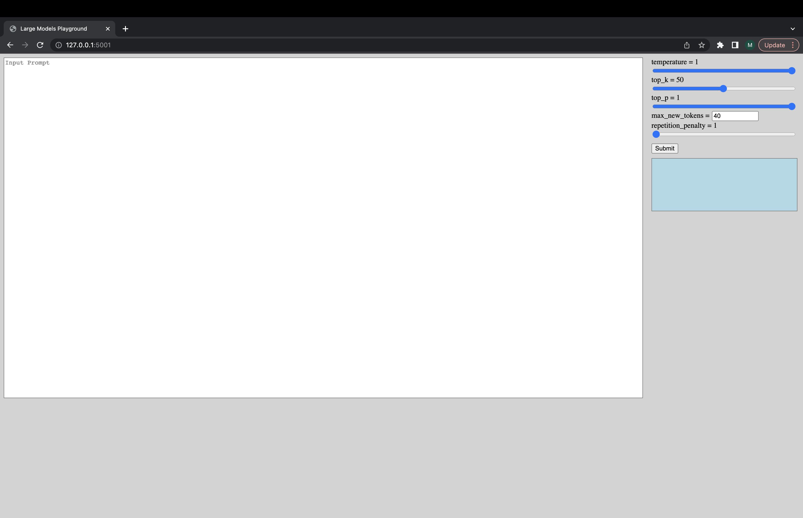

# Fast Inference Solutions for BLOOM

This repo provides demos and packages to perform fast inference solutions for BLOOM. Some of the solutions have their own repos in which case a link to the [corresponding repos](#Other-inference-solutions) is provided instead.


# Inference solutions for BLOOM 176B

We support HuggingFace accelerate and DeepSpeed Inference for generation.

Install required packages:

```shell
pip install flask flask_api gunicorn pydantic accelerate huggingface_hub>=0.9.0 deepspeed>=0.7.3 deepspeed-mii==0.0.2
```

alternatively you can also install deepspeed from source:
```shell
git clone https://github.com/microsoft/DeepSpeed
cd DeepSpeed
CFLAGS="-I$CONDA_PREFIX/include/" LDFLAGS="-L$CONDA_PREFIX/lib/" TORCH_CUDA_ARCH_LIST="7.0" DS_BUILD_CPU_ADAM=1 DS_BUILD_AIO=1 DS_BUILD_UTILS=1 pip install -e . --global-option="build_ext" --global-option="-j8" --no-cache -v --disable-pip-version-check
```

All the provided scripts are tested on 8 A100 80GB GPUs for BLOOM 176B (fp16/bf16) and 4 A100 80GB GPUs for BLOOM 176B (int8). These scripts might not work for other models or a different number of GPUs.

DS inference is deployed using logic borrowed from DeepSpeed MII library.

Note: Sometimes GPU memory is not freed when DS inference deployment crashes. You can free this memory by running `killall python` in terminal.

For using BLOOM quantized, use dtype = int8. Also, change the model_name to microsoft/bloom-deepspeed-inference-int8 for DeepSpeed-Inference. For HF accelerate, no change is needed for model_name.

HF accelerate uses [LLM.int8()](https://arxiv.org/abs/2208.07339) and DS-inference uses [ZeroQuant](https://arxiv.org/abs/2206.01861) for post-training quantization.

## BLOOM inference via command-line

This asks for generate_kwargs everytime.
Example: generate_kwargs =
```json
{"min_length": 100, "max_new_tokens": 100, "do_sample": false}
```

1. using HF accelerate
```shell
python -m inference_server.cli --model_name bigscience/bloom --model_class AutoModelForCausalLM --dtype bf16 --deployment_framework hf_accelerate --generate_kwargs '{"min_length": 100, "max_new_tokens": 100, "do_sample": false}'
```

2. using DS inference
```shell
python -m inference_server.cli --model_name microsoft/bloom-deepspeed-inference-fp16 --model_class AutoModelForCausalLM --dtype fp16 --deployment_framework ds_inference --generate_kwargs '{"min_length": 100, "max_new_tokens": 100, "do_sample": false}'
```

## BLOOM server deployment

[make <model_name>](../Makefile) can be used to launch a generation server. Please note that the serving method is synchronous and users have to wait in queue until the preceding requests have been processed. An example to fire server requests is given [here](./server_request.py). Alternativey, a [Dockerfile](./Dockerfile) is also provided which launches a generation server on port 5000.

An interactive UI can be launched via the following command to connect to the generation server. The default URL of the UI is `http://127.0.0.1:5001/`. The `model_name` is just used by the UI to check if the model is decoder or encoder-decoder model.
```shell
python -m ui --model_name bigscience/bloom
```
This command launches the following UI to play with generation. Sorry for the crappy design. Unfotunately, my UI skills only go so far. 😅😅😅


## Benchmark system for BLOOM inference

1. using HF accelerate
```shell
python -m inference_server.benchmark --model_name bigscience/bloom --model_class AutoModelForCausalLM --dtype bf16 --deployment_framework hf_accelerate --benchmark_cycles 5
```

2. using DS inference
```shell
deepspeed --num_gpus 8 --module inference_server.benchmark --model_name bigscience/bloom --model_class AutoModelForCausalLM --dtype fp16 --deployment_framework ds_inference --benchmark_cycles 5
```
alternatively, to load model faster:
```shell
deepspeed --num_gpus 8 --module inference_server.benchmark --model_name microsoft/bloom-deepspeed-inference-fp16 --model_class AutoModelForCausalLM --dtype fp16 --deployment_framework ds_inference --benchmark_cycles 5
```

3. using DS ZeRO
```shell
deepspeed --num_gpus 8 --module inference_server.benchmark --model_name bigscience/bloom --model_class AutoModelForCausalLM --dtype bf16 --deployment_framework ds_zero --benchmark_cycles 5
```

# Support


If you run into things not working or have other questions please open an Issue in the corresponding backend:

- [Accelerate](https://github.com/huggingface/accelerate/issues)
- [Deepspeed-Inference](https://github.com/microsoft/DeepSpeed/issues)
- [Deepspeed-ZeRO](https://github.com/microsoft/DeepSpeed/issues)

If there a specific issue with one of the scripts and not the backend only then please open an Issue here and tag [@mayank31398](https://github.com/mayank31398).


# Other inference solutions
## Client-side solutions

Solutions developed to perform large batch inference locally:

* [Custom HF Code](https://github.com/huggingface/transformers_bloom_parallel/).

JAX:

* [BLOOM Inference in JAX](https://github.com/huggingface/bloom-jax-inference)


## Server solutions

A solution developed to be used in a server mode (i.e. varied batch size, varied request rate) can be found [here](https://github.com/Narsil/bloomserver). This is implemented in Rust.
